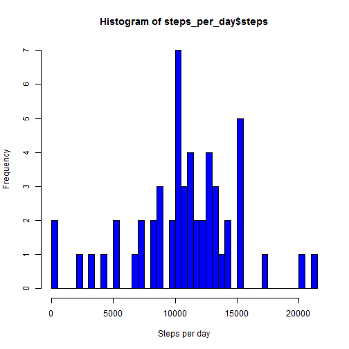
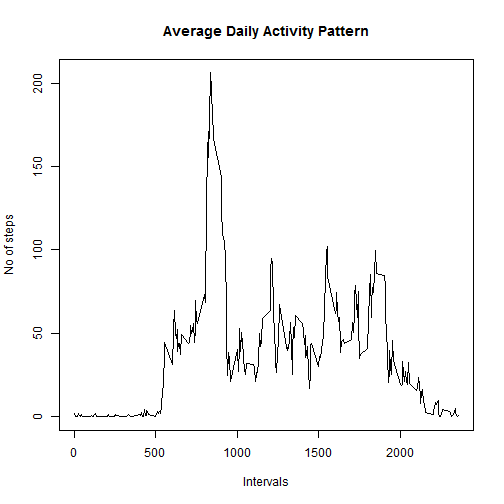
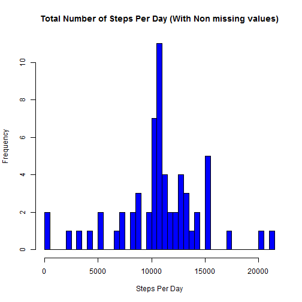
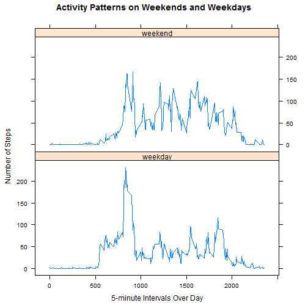

Reproducible Research: Peer Assessment 1
========================================================

## Loading and preprocessing the data

```r
library(plyr)
library(lattice)
unzip("activity.zip")
activity <- read.csv("activity.csv")
```

## What is the mean total number of steps taken per day?

```r
# Make a histogram of the total number of steps taken each day
steps_per_day <- aggregate(steps ~ date, data=activity, FUN=sum)
hist(steps_per_day$steps, breaks=nrow(steps_per_day), xlab="Steps per day", col="blue")
```

 

```r
# mean and median total number of steps taken per day
mean_steps <- mean(steps_per_day$steps)
med_steps <- median(steps_per_day$steps)
```
The mean number of steps taken per day: 10766  
The median number of steps taken per day: 10765 

## What is the average daily activity pattern?

```r
# time series plot
step_interval <- aggregate(steps ~ interval, data=activity, FUN=mean)
plot(step_interval, type="l", main = "Average Daily Activity Pattern", 
    xlab = "Intervals", 
    ylab = "No of steps")
```

 

```r
# maximum number of steps
max_steps <- step_interval$interval[which.max(step_interval$steps)]
```
The max number of steps is 835

## Imputing missing values

```r
## total number of missing values
missing <- sum(is.na(activity))
```
Missing / NA values in the dataset is 2304. 

I will replace the NAs with the means for the 5-minute intervals.


```r
# 3. New dataset without missing values
complete_act <- merge(activity, step_interval, by="interval", suffixes=c("",".y"))
is_missing <- is.na(complete_act$steps)
complete_act$steps[is_missing] <- complete_act$steps.y[is_missing]
complete_act <- complete_act[,c(1:3)]
```

```r
# 4. Histogram
comp_steps_day <- aggregate(steps ~ date, data = complete_act, FUN=sum)
hist(comp_steps_day$steps, breaks=nrow(comp_steps_day), main="Total Number of Steps Per Day (With Non missing values)", xlab="Steps Per Day", col="blue")
```

 

```r
# Calculate the mean and median total number of steps taken per day
comp_steps_day_mean <- mean(comp_steps_day$steps)
comp_steps_day_med <- median(comp_steps_day$steps)
```
The mean total number of steps taken per day is 10766  
The median total number of steps taken per day is 10766 


```r
# create a factor for weekday / weekend
daytype <- function(date) {
    if (weekdays(as.Date(date)) %in% c("Saturday", "Sunday")) {
        "weekend"
    } else {
        "weekday"
    }
}
complete_act$daytype <- as.factor(sapply(complete_act$date, daytype))

avg_steps <- ddply(complete_act, .(interval, daytype), summarize, steps = mean(steps))

xyplot(steps ~ interval | daytype, data = avg_steps, type = "l", layout = c(1, 2),
       xlab="5-minute Intervals Over Day", ylab="Number of Steps",
       main="Activity Patterns on Weekends and Weekdays")
```

 
